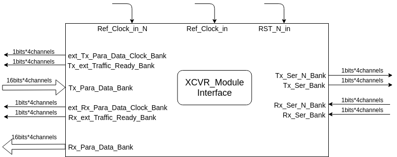
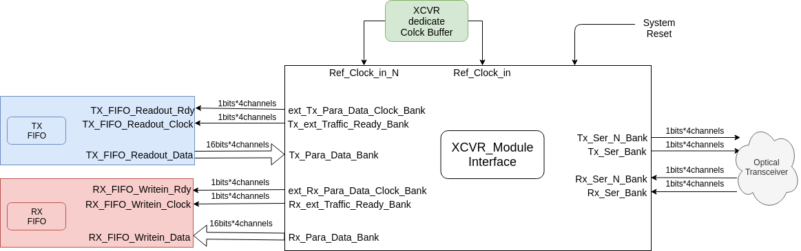

# User manual for XCVR module

## Abstracts

User interface for application.
Include the following 2 files:

1.DataStruct_param_def_header.vhd
2.XCVR_top.vhd

User must insert the following 2 line codes on the beginning of your vhdl file to invoke this module:

```vhdl
library work;
use work.DataStruct_param_def_header.all;
```

## Block diagram

### This is interface(top view) of "XCVR_top.vhd"



| Port                      | Description                                                                       |
| ------------------------- | --------------------------------------------------------------------------------- |
| RST_N_in                  | System reset input for this module, Negative action.                              |
| ------------------------- | --------------------------------------------------------------------------------- |
| Ref_Clock_in_P            | Reference clock input for transceiver. Positive port.                             |
| Ref_Clock_in_N            | Reference clock input for transceiver. Negative port.                             |
| ------------------------- | --------------------------------------------------------------------------------- |
| TX_ser_P_bank             | TX positive serial data port. Connect to Optical module.                          |
| RX_ser_P_bank             | RX positive serial data port. Connect to Optical module.                          |
| TX_ser_N_bank             | TX Negative serial data port. Connect to Optical module.                          |
| RX_ser_N_bank             | RX Negative serial data port. Connect to Optical module.                          |
| ------------------------- | --------------------------------------------------------------------------------- |
| ext_tx_para_data_clk_bank | Tx clock output for Parallel data.                                                |
| ext_rx_para_data_clk_bank | Rx clock output for Parallel data.                                                |
| ------------------------- | --------------------------------------------------------------------------------- |
| tx_traffic_ready_ext_bank | Flag of Tx ready. '1' for ready.                                                  |
| rx_traffic_ready_ext_bank | Flag of Rx ready. '1' for ready.                                                  |
| ------------------------- | --------------------------------------------------------------------------------- |
| tx_Para_data_bank         | Parallel data input, 16 bits, sync to ext_tx_para_data_clk_bank                   |
| rx_Para_data_bank         | Parallel data output, 16 bits, sync to ext_rx_para_data_clk_bank                  |

### This is recommanded for usage



As Picture, I recommand user add TX FIFO and RX FIFO for your application.

## Parameters

### These are parameters of "DataStruct_param_def_header.vhd"

| Parameter                                | Description                                                                                                                      |
| ---------------------------------------- | -------------------------------------------------------------------------------------------------------------------------------- |
| xcvr_ser_internal_loopback_en            | For "000", loop-back off. For "001",  loop-back on.                                                                              |
| ---------------------------------------- | -------------------------------------------------------------------------------------------------------------------------------- |
| grouping_enable                          | For '1', enable grouping.                                                                                                        |
| ---------------------------------------- | -------------------------------------------------------------------------------------------------------------------------------- |
| scr_para_Data_gen_check_form_this_module | Test pattern is internal generated when '1'. When '0', user needs to feed your own data to this module.                          |
| ---------------------------------------- | -------------------------------------------------------------------------------------------------------------------------------- |
| ref_clock_from_ext                       | '1', clock from external.                                                                                                        |

#### Note: It is not recommended to change other parameters, if you don't understand it.
